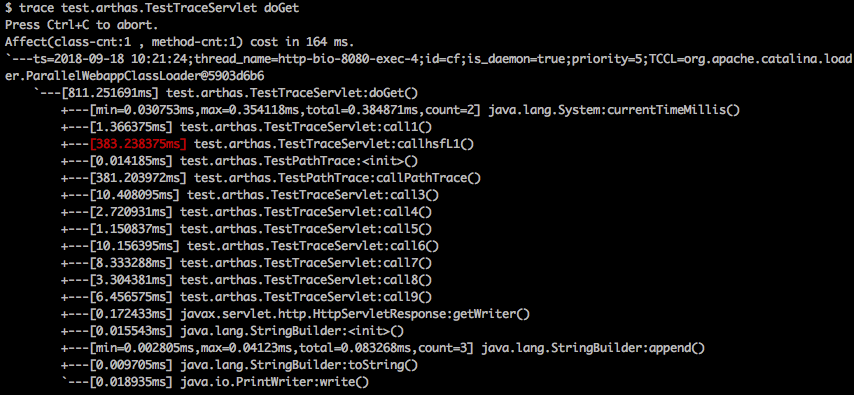

# Tech Talk: Arthas Tool

This is an overview of the [Arthas](https://arthas.aliyun.com/en/) tool, which is a complete set of diagnostic tools to troubleshoot JVM issues on the fly. 

It is open sourced project by Alibaba.   → GitHub [here](https://github.com/alibaba/arthas)

The doc is available [here](https://arthas.aliyun.com/en/doc)<br/>

 
 
 - [Introduction](#introduction)
 - [Usage](#usage)
 - [Typical USE CASES](#typical-use-cases):
     - [Change CLASS definition on the fly](#change-class-definition-on-the-fly)
     - [Intercept calls to a method and show PARAMS, RETURN value and EXCEPTIONS](#intercept-calls-to-a-method-and-show-params-return-value-and-exceptions)
     - [Inspect / Set variable value](#inspect--set-variable-value)  
     - [Invoke method](#invoke-method)  
     - [Force GC](#force-gc)  

<br/>
<br/>

## Introduction

Arthas allows developers to troubleshoot production issues for Java applications without modifying code or restarting servers.</br>

So it helps developers to address scenarios like the following:

* There is an error in production under particular conditions, If I could add more log I would be able to see what is going on ! 
* I believe changing the logic in a method would fix a problem, but I can not test it until a full release cycle is performed and that is not possible now.
* I know this method fails but in order to know why I need to know the value of the parameter passed in a particular method.
* An instance variable value is set incorrectly, If I could change the value then I would be able to fix a potential problem.
* I’d like to force a Garbage Collector to understand a given issue.
* I’d like to inspect the values of a certain object to understand a given issue.
* I’d like to debug / profile the application while running to understand what is going on.

 
Arthas process is “attached” to a given running Java application in a way that it can access and manipulate the JVM running the Java app.</br>
NOTE: Arthas and the JVM must be running in the same machine. It does not allow to “attach” remotely.

 
Once attached, Arthas will offer a console to enter Arthas [commands](https://arthas.aliyun.com/en/doc/commands.html). There are more than 45 available, although in this tech talk only a small selection will be explained

Besides, in this tech talk two utility files are attached to use Arthas easily in Kubernetes clusters (see APPENDIX 1):

* [kubernetes_arthas_execution.sh](./kubernetes_arthas_execution.sh)
* [kubernetes_file_upload.sh](./kubernetes_file_upload.sh)

<br/>
<br/>
 
## Usage
 
In order to use Arthas, download it and execute it in any environment running a JVM
```
curl -O https://arthas.aliyun.com/arthas-boot.jar
java -jar arthas-boot.jar   
```
Once executed, there will be a prompt to select the desired JVM
```
 
[INFO] JAVA_HOME: /usr/lib/jvm/java-8-openjdk-amd64/jre
[INFO] arthas-boot version: 3.7.2
[INFO] Found existing java process, please choose one and input the serial number of the process, eg : 1. Then hit ENTER.
* [1]: 130961 org.gradle.launcher.daemon.bootstrap.GradleDaemon
  [2]: 131521 com.test.SearchApplication
  [3]: 14026 com.intellij.idea.Main

```
Now you have to choose one of the JVM, once selected, the Arthas console will appear:

```
2
[INFO] arthas home: /home/victor.porcar/.arthas/lib/3.7.2/arthas
[INFO] Try to attach process 131521
ws_powersearch2/capability-iris 
                          -sdp-search/service-iris-sdp-search/build/classes/java/main:/h 
                          ome/victor.porcar/workspaces/ws_powersearch2/capability-iris-s 
                          dp-search/service-iris-sdp-search/build/resources/main:/home/vPicked up JAVA_TOOL_OPTIONS: 
[INFO] Attach process 131521 success.
[INFO] arthas-client connect 127.0.0.1 3658
  ,---.  ,------. ,--------.,--.  ,--.  ,---.   ,---.                           
 /  O  \ |  .--. ''--.  .--'|  '--'  | /  O  \ '   .-'                          
|  .-.  ||  '--'.'   |  |   |  .--.  ||  .-.  |`.  `-.                          
|  | |  ||  |\  \    |  |   |  |  |  ||  | |  |.-'    |                         
`--' `--'`--' '--'   `--'   `--'  `--'`--' `--'`-----'                          

wiki       https://arthas.aliyun.com/doc                                        
tutorials  https://arthas.aliyun.com/doc/arthas-tutorials.html                  
version    3.7.2                                                                
main_class                                                                      
pid        131521                                                               
time       2024-06-06 10:12:27                                                  


```
Then from the console you can use any Arthas commands

for example one of the simplest ones is `jvm`command that will show information of the JVM context
```
[arthas@36030]$ jvm
 RUNTIME                                                                                 
-----------------------------------------------------------------------------------------
 MACHINE-NAME             36030@VPC00560                                                 
 JVM-START-TIME           2024-06-27 09:14:40                                            
 MANAGEMENT-SPEC-VERSION  1.2                                                            
 SPEC-NAME                Java Virtual Machine Specification                             
 SPEC-VENDOR              Oracle Corporation                                             
 SPEC-VERSION             1.8                                                            
 VM-NAME                  OpenJDK 64-Bit Server VM                                       
 VM-VENDOR                Private Build                                                  
 VM-VERSION               25.412-b08                                                     
 INPUT-ARGUMENTS          -Dfile.encoding=UTF-8                                          
                          -Duser.country=GB                                              
                          -Duser.language=en                                             
                          -Duser.variant                                                 
 CLASS-PATH               ....
 
< MORE INFORMATION .....>
Change CLASS definition on the fly
```
NOTE: **Once we have finished our work in Arthas, it is very important to CLOSE its process by using command `stop`**
<br/><br/>
```
[arthas@299291]$ stop
Resetting all enhanced classes ...
Affect(class count: 0 , method count: 0) cost in 1 ms, listenerId: 0
Arthas Server is going to shutdown...
[arthas@299291]$ session (c0138352-a90e-4d55-b3d0-a8fb5aafda65) is closed because server is going to shutdown.

```

If the **stop** command can not be applied for any reason, Arthas can be closed manually by killing its process
 
```
ps -ef | grep 'java -jar arthas-boot.jar'
kill <PID> 
```
<br/>
<br/>

## Typical Use Cases

<br/>
<br/>

### Change CLASS definition on the fly

In order to change the definition of a class on the fly, Arthas offers command [`retransform`](https://arthas.aliyun.com/en/doc/retransform.html)

steps:
1) regenerate the new version of the class you wish to change using your IDE locally. If that is not possible, then generate new artifact as rar and unzipped it to find the corresponding class file.
2) copy class file in any working local folder
3) execute Arthas -> `java -jar arthas-boot.jar` and use the command retransform
```
[arthas@10]$ retransform <LOCAL_FOLDER>/MyClass.class
[arthas@10]$ stop
```
*NOTE:* the new version of the class can not have more methods that the original and can not change their signatures. in other words, it is allowed to change only the "body" of the methods, otherwise a exception like this would happen:
<br/>
`retransform error! java.lang.UnsupportedOperationException: class redefinition failed: attempted to add a method`

The new class can not add or delete attributes

NOTE: this technique can be useful to add more logs or change the logic of a particular method.

<br/>
<br/>

### Intercept calls to a method and show PARAMS, RETURN value and EXCEPTIONS

Before explaining how to do it using command watch, it is worth to mention that params, return value and exceptions can be examined by adding proper log lines using the previous technique to change class definition "on the fly".

Now, let's see how to do it using command [watch](https://arthas.aliyun.com/en/doc/watch.html): let's suposse there is a function in class (com.test.MyClass) which is called from time to time

```java

    public  int myMethod(String customer, List<String> list) throws IOException {
         int returnValue = list.size();
         String joinString = String.join(" - ", list);
         int sizeJoinString = joinString.length() + customer;
         return sizeJoinString;
    }
```

The following Arthas command will show for each invocation (grouped in seconds) all the params, returned object and exception (if exist) 

```
[arthas@10]$ watch com.test.MyClass myMethod '{params[0],params[1],returnObj,throwExp}' -x 2
[arthas@10]$ stop
```
where in this case:

*params[0]* -> first parameter passed to the method<br/><br/>
*params[1]* -> second parameter passed to the methdp<br/><br/>
*returnObj* -> returned value (null if the method return void)<br/><br/>
*throwExp*  -> launched exception (if any)<br/><br/>


then the outcome would be like:

```

method=com.test.MyClass.myMethod location=AtExit
ts=2024-06-05 13:43:17; [cost=0.024663ms] result=@ArrayList[
    @String[1100075],             <---------- THIS MEANS that first parameter is a String with value 1100075
    @ArrayList[                   <---------- THIS MEANS that second parameter is a list with two parameters   
        @String[hola],
        @String[caracola],
    ],
    @Integer[15],                <---------- THIS MEANS return value is 15
    null,                        <---------- THIS MEANS THERE IS NO EXCEPTION
]


```

Now let's assume the second parameter of the method (the list) is null
let's execute the same arthas command
 
the result would be
```
method=com.test.MyClass.myMethod location=AtExceptionExit
ts=2024-06-05 13:45:42; [cost=0.037923ms] result=@ArrayList[
    @String[1200002],
    null,
    null,
    java.lang.NullPointerException
	at com.test.MyClass.myMethod(Test.java:264)
	at com.test.MyClass.lambda$getCallableForThread$0(Test.java:213)
	at java.util.concurrent.FutureTask.run(FutureTask.java:266)
	at java.util.concurrent.ThreadPoolExecutor.runWorker(ThreadPoolExecutor.java:1149)
	at java.util.concurrent.ThreadPoolExecutor$Worker.run(ThreadPoolExecutor.java:624)
	at java.lang.Thread.run(Thread.java:750)
,
]
```
 In order to intercept only when a condition is matched (in this case first parameter "customer" equals to "1100009"
```
[arthas@10]$ watch com.test.MyClass myMethod '{params[0],params[1],returnObj,throwExp}'  'params[0] eq 1100009' -x 2
[arthas@10]$ stop
```


### Inspect / Set variable value 

Let's assume there is an instance variable called "inProgress" in class com.test.MyClass and assume there is only one instance
of this class (singleton)

The command `vmtool` allows to inspect / set the value of this attribute

INSPECT
 ```
[arthas@10]$ vmtool --action getInstances -className com.test.MyClass --express instances[0].inProgress
[arthas@10]$ stop
```

SET
```
[arthas@10]$ options strict false
[arthas@10]$ vmtool --action getInstances -className com.test.MyClass --express instances[0].inProgress=false
[arthas@10]$ stop
```

NOTE: in the --express argument you can use any [OGNL](https://commons.apache.org/dormant/commons-ognl/)  expression, as described in the APPENDIX section. So if we want to select an specific instance over many other, a OGNL can be used to filter over it:

```
vmtool --action getInstances -className com.test.MyClass --express instances.{^ #this.getId().equals(1)}.inProgress
```
 
<br/>
<br/>

### Invoke method

Let's assume there is an instance of class com.test.MyClass and assume which have a public method `getList()` and let's assume that there is only one instanceof this class (singleton)

The command vmtool allows to invoke that method (similar to inspect/set variable)
 
```
[arthas@10]$ vmtool --action getInstances  --className tcom.test.MyClass --express instances[0].getList()
[arthas@10]$ stop
```

<br/>
<br/>

### Profile invocation of a method

use command `trace`
```
[arthas@10]$ [arthas@10]$ trace com.test.MyClass getList
[arthas@10]$ stop
```


<br/>
<br/>


### Force GC
 
The command vmtool can force the GC as follows:
 
```
[arthas@10]$ vmtool --action forceGc
[arthas@10]$ stop
```
 


